# mathematical_modeling
Sorting out algorithms for mathematical modeling

边学边整理数学建模中的常见算法和案例

## 国家二等奖！！！
在[2020 华为杯中国研究生数学建模大赛](https://cpipc.chinadegrees.cn/)获得国家二等奖！  
非常感谢小组成员：[Derun Li](https://github.com/fight-ldr)和[ZiLin Xin]()，一起共同努力、克服重重困难达到的结果！虽然是第一次参赛，但是我们一起合作得很顺利、很开心！ps: 希望以后还有机会一起合作啊~

我们选取的是F题。  
**代码之后开源**

### 1. 题目概述
**问题背景**  
飞行器供油策略设计是飞行器设计研究中的一项主要内容，合理的供油设计具有节省燃料，提高续航里程等优势。且由于飞行器布置空间的限制，飞行器通常设计若干个油箱以满足飞行器任务要求和发动机工作需求。在任务执行过程中，飞行器的质心变化对飞行器的控制有着重要的影响，各个油箱内油量的分布和供油策略将导致飞行器质心的变化，进而影响到对飞行器的控制。因此，制定各油箱的供油策略是这类飞行器控制的一项重要任务。在实际过程中，为表达方便，油箱的供油策略可用其向发动机或其它油箱供油的速度曲线来描述。
在分析飞行器供油策略的过程中，对飞行器的结构和相关供油限制作出以下假设和要求：
1. 油箱均为长方体且固定在飞行器内部。长、宽、高的三个方向与飞行器坐标系的x,y,z轴三个方向平行。
2. 在飞行器坐标系下，飞行器（不载油）质心为 （0，0，0），第 个空油箱中心位置为 ， 。飞行器（不载油）总重量为 。飞行器各油箱位置示意图如下图所示：
   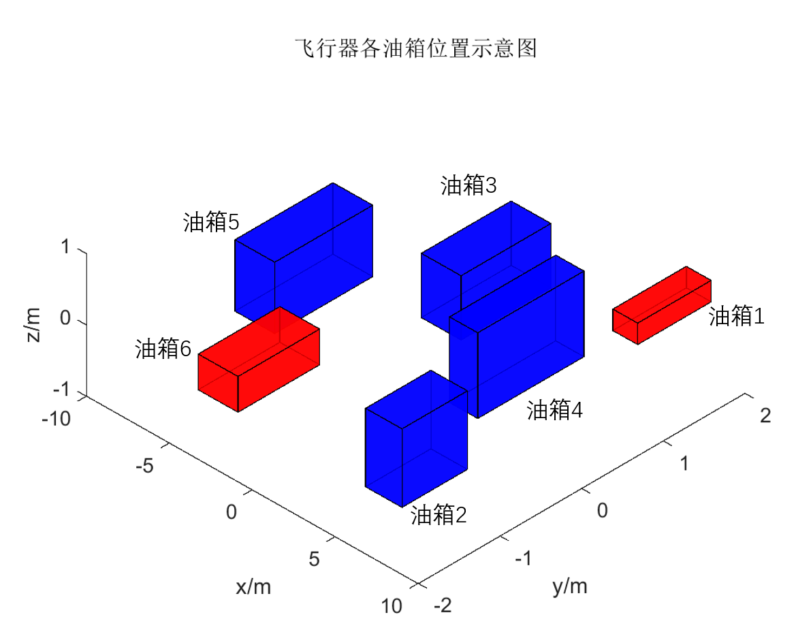
3. 第i个油箱的供油速度上限为  ( >0)， 。每个油箱一次供油的持续时间不少于60秒。
4. 主油箱2、3、4、5可直接向发动机供油，油箱1和油箱6作为备份油箱分别为油箱2和油箱5供油，不能直接向发动机供油。
5. 由于受到飞行器结构的限制，至多2个油箱可同时向发动机供油，至多3个油箱可同时供油。
6. 飞行器在执行任务过程中，各油箱联合供油的总量应至少满足发动机的对耗油量的需要（若某时刻供油量大于计划耗油量，多余的燃油可通过其它装置排出飞行器）。
7. 飞行器在飞行过程中会发生姿态改变，主要是飞行航向上的上下俯仰或左右偏转。为简化问题，假设本题目中飞行器姿态的改变仅考虑平直飞与俯仰情况。飞行器的俯仰将导致各油箱相对地面的姿态发生倾斜，在重力作用下，油箱的燃油分布也随之发生变化，从而使得飞行器质心发生偏移。油箱姿态变化示意图如下图所示，左图为飞行器在地面时油箱的状态，右图虚线代表油箱姿态改变后燃油水平面。
    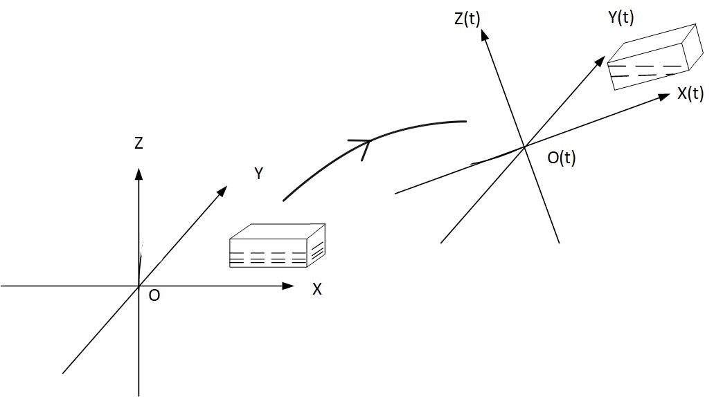

**待解决问题**  
针对飞行器的供油策略，本文需要解决以下问题：
1. 问题1.：根据记录的飞行器某次任务中6个油箱的供油速度及飞行器在飞行过程中俯仰角变化数据，计算相应时刻飞行器的质心位置且绘制质心变化曲线，并讨论算法的有效性和复杂性。
2. 问题2.：根据记录的飞行器某次任务中计划耗油速度数据与飞行器理想质心位置数据，为飞行器设计满足前述约束条件且只考虑平飞的油箱供油策略，该策略使飞行器每一时刻的质心位置与理想质心位置的欧式距离的最大值达到最小。并给出该策略下相应时刻的6个油箱各自的供油速度、4个主油箱的总供油速度、飞行器瞬时质心与理想质心距离的最大值和4个主油箱的总供油量。最后讨论算法的有效性和复杂性。
3. 问题3：根据记录的飞行器某次任务中计划耗油速度数据与飞行器理想质心位置数据，在初始各油箱燃料未定的情况下，为飞行器设计满足前述约束条件且只考虑平飞的油箱供油策略，策略要保证飞行任务结束时6个油箱剩余燃油总量至少1m^3，同时使飞行器每一时刻的质心位置与理想质心位置的欧式距离的最大值达到最小。并给出该策略下相应时刻的6个油箱各自的供油速度、4个主油箱的总供油速度、飞行器瞬时质心与理想质心距离的最大值和4个主油箱的总供油量。并讨论算法的有效性和复杂性。
4. 问题4. 根据记录的飞行器某次任务中计划耗油速度数据与飞行器俯仰角变化数据，为飞行器设计满足前述约束条件且考虑俯仰的油箱供油策略，该供油策略使飞行器每一时刻的质心位置与飞行器坐标系原点的欧式距离的最大值达到最小。并给出该策略下相应时刻的6个油箱各自的供油速度、4个主油箱的总供油速度、飞行器瞬时质心位置与飞行器坐标原点的最大距离偏差和4个主油箱的总供油量。最后讨论算法的有效性和复杂性。

### 2. 题目分析【重点介绍问题一和问题四】
#### 问题一
*问题分析*  
问题1要根据记录的飞行器某次任务中6个油箱的供油速度及飞行器在飞行过程中俯仰角变化数据，计算相应时刻飞行器的质心位置且绘制质心变化曲线。  
分析易得：随着飞行器的运行，油液在油箱内的分布形状变化将会影响油箱内的质量分布，进而会改变飞行器的质心位置。根据假设条件考虑，对油箱的质量分布造成影响的原因主要为油液的小号和液面与飞行器俯仰角同步变化。  
本问题首先可根据油液当前时刻在油箱中的分布情况利用微元法求得每一油箱的质心位置，进而根据多质点方程计算出飞行器的质心位置。下一时刻油液在油箱中的分布情况可根据给出的油箱供油速度曲线算出。  
*模型建立*  
主要公式： 
    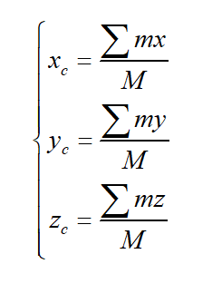

模型求解： 
    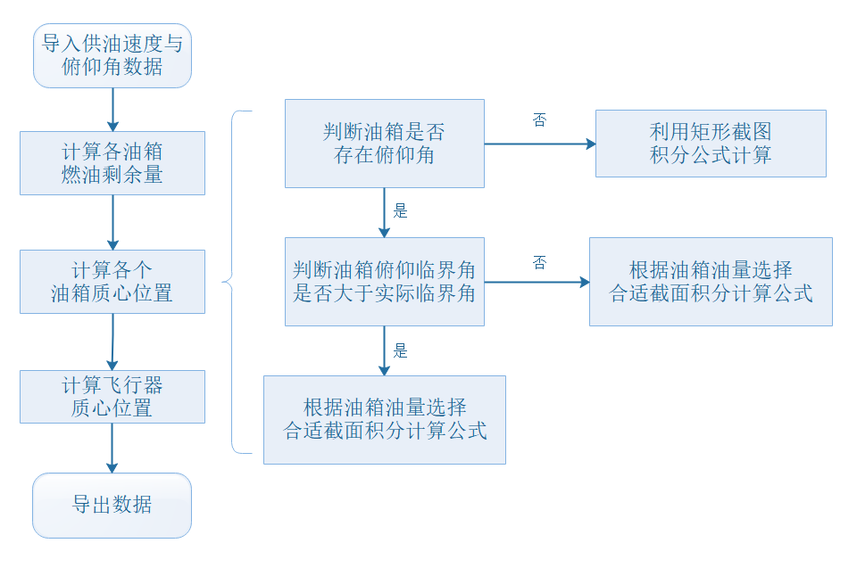

#### 问题四
*问题分析*  
问题2要根据记录的飞行器某次任务中任一时刻的发动机耗油速度及理想质心位置，设计飞行器在平飞下的供油策略，使得飞行器在每一时刻的实际质心位置与理想质心位置距离的最大值最小。 
1. 飞行器实际质心位置简化计算方法。飞行器在始终保持平飞（俯仰角为0）的情况下，各油箱不会发生姿态变化，则各油箱自身质心在飞行器坐标系O(t)-X(t)Y(t)Z(t)下 和 坐标保持不变，只有 坐标随油箱剩余油量质量变化而变化。则可以对质心模型进行简化后采用质点系质心坐标公式[问题一中]求解。
2. 构建混合整数非线性规划模型。由于各油箱的供油速度（线性变量）和是否开启（0-1二值变量）均受到题目中条件（1）-（6）的约束，同时需要尽可能地保证实际质心位置与理想质心位置接近（非线性目标函数），则可以将该问题转化为典型优化问题。
3. 每个油箱一次供油的持续时间不少于60秒的约束实现。下图中圆圈表示当前t时刻开启油箱状态，开启为1，未开启为0；方形表示t时刻油箱状态变化量，值为t+1时刻的油箱开启状态减去t时刻的油箱开启状态。可以发现，在油箱开启瞬间，该值为1，在油箱关闭瞬间，该值为-1，而其他时刻均为0。为了满足开启后至少连续60秒持续供油的约束条件，可以将t时刻的油箱开启状态变量往后累加60秒，需要大于该时刻的油箱状态变化量与60的乘积。若i油箱在t时刻是否供油表示为 ，则约束实现可用下式表示。
    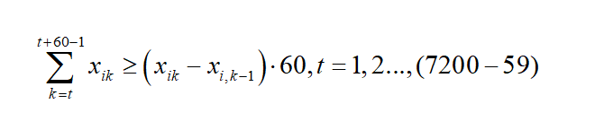

60秒的约束实现示意图:  
    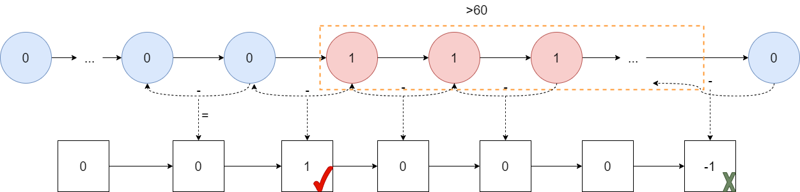

*模型建立*  
主要公式： 
    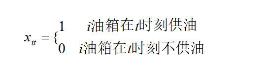
    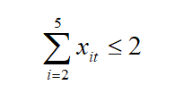 
    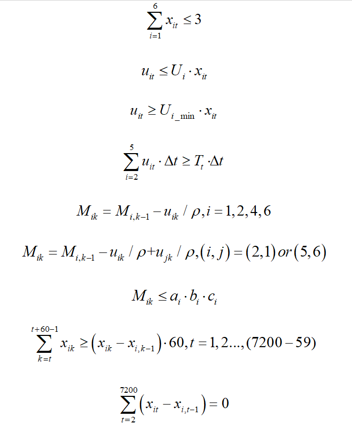

模型求解： 
本文将采用一种新的模型结构，并在matlab中进行求解。 
其中，首先建立决策器模块，利用目前已知信息，得到所需的供油信息，再通过求解器，利用信息对当前时刻供油量数值进行求解，并将更新后的信息反馈回决策器，继续进行解算。  
该模型通过决策器的规划和决策作用，一定程度上规避了某些特殊约束的解算问题，从而更好地获得供油量的解。  
采用问题1构建的非线性多体质心模型来考虑实际任务规划过程中的飞行器俯仰角变化对质心平衡的影响。而后，建立基于各油箱质心向量权重的智能决策器模型确定当前开启油箱对象（同时考虑满足连续开启时间大于60秒）和基于非线性优化目标函数的滚动优化模型确定需要开启油箱对象的最佳供油速度。该算法相比于分支定界法提高了61%的求解速率，能在有限时间内求得该非线性复杂模型的局部最优解。最终求解出飞行器瞬时质心与理想质心距离的最大值为0.1707m，4个主油箱的总供油量为7.9451m^3，即6753.4kg，非常好地降低了质心偏差。 
**决策器模型**  
    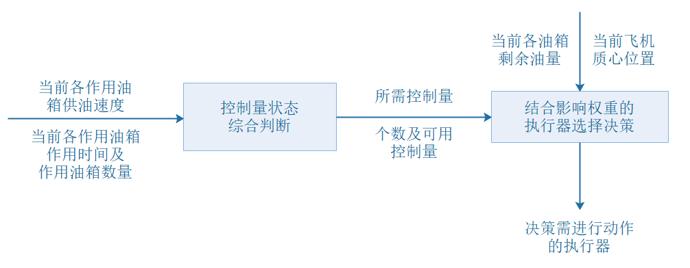

**滚动优化模型**   
    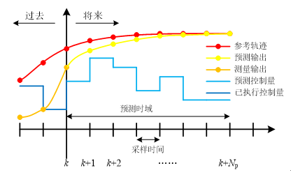

### 3. 算法结果
#### 问题一
三维空间中质心位置变化曲线:  
    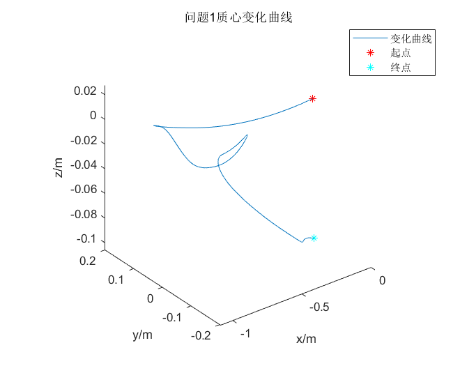

三维空间中质心位置变化曲线:  
    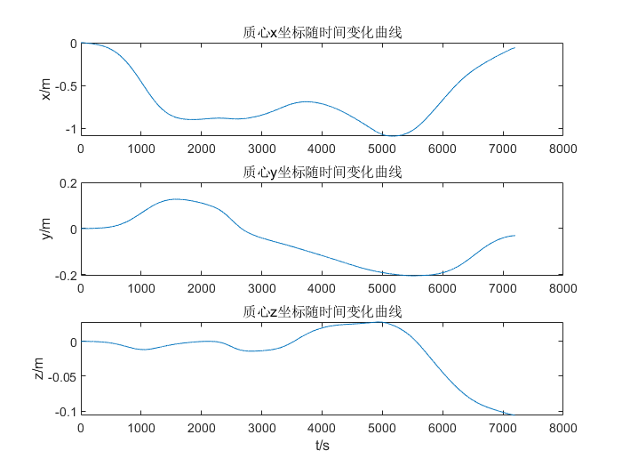

#### 问题二
各油箱最优供油速度曲线:  
    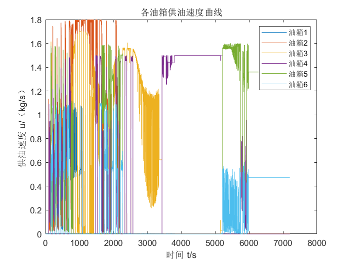

主油箱的总供油速度曲线:  
    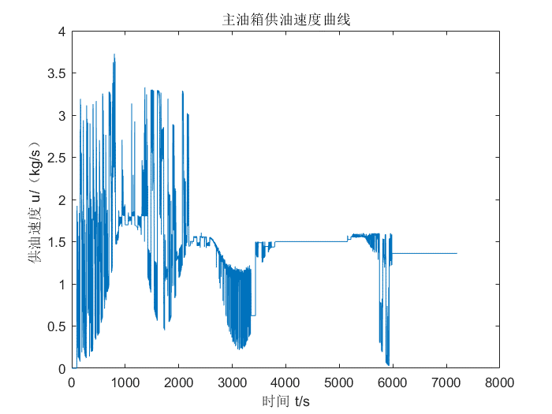

质心位置变化曲线:  
    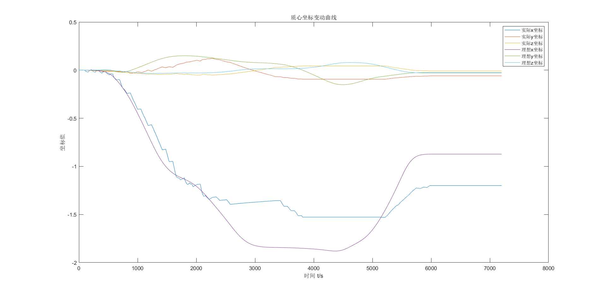

质心坐标偏差曲线:  
    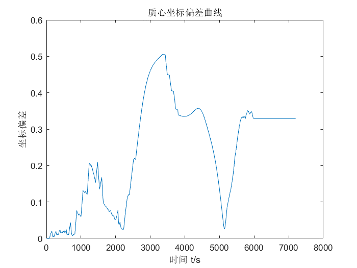

#### 问题三
各油箱供油速度曲线： 
    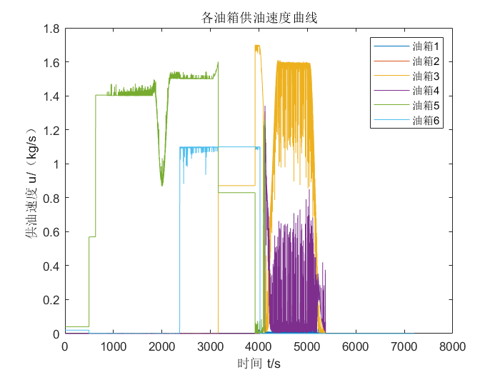

主油箱供油速度曲线:  
    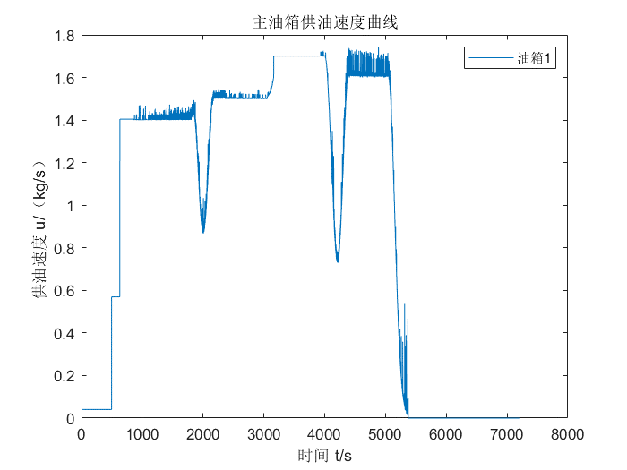

#### 问题四
各油箱供油速度曲线:  
    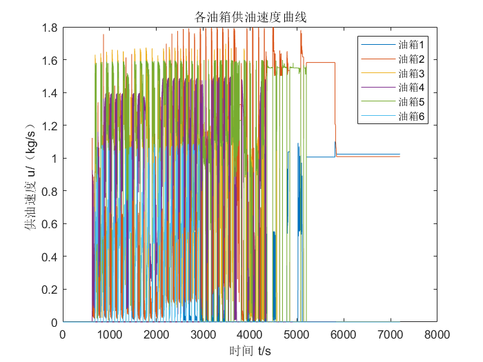

主油箱供油速度曲线:  
    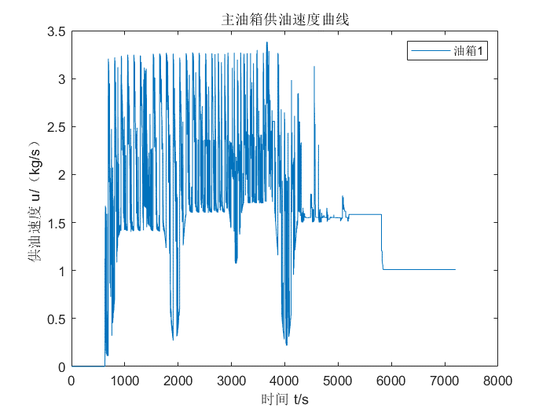

各坐标轴质心坐标变动曲线:  
    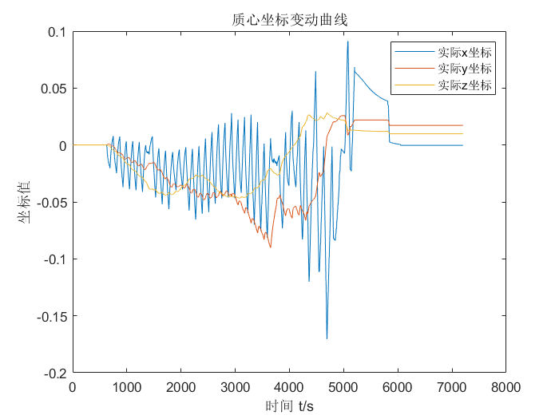

质心位置偏差曲线:  
    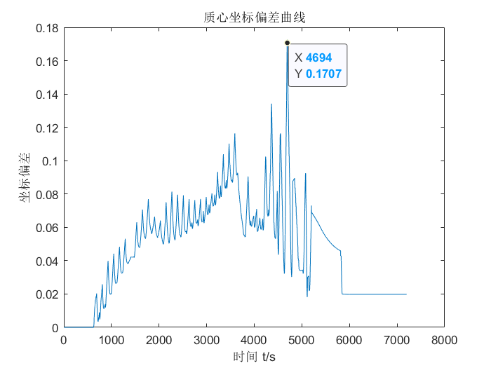

## 练习算法整理
### 1. 优化问题optimization

案例1——平板车装货问题

[example1](https://github.com/YaominJun/mathematical_modeling/tree/master/1optimization_algorithms)

